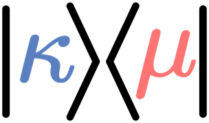

<p align="center">
  <picture>
    <source media="(prefers-color-scheme: dark)" srcset="assets/logo-dark.webp">
    
  </picture>
</p>

<h1 align="center">Kooshan Maleki</h1>

<p align="center">
  Master's student &amp; researcher<br>
  <sub>KU Leuven · eBRAIN Lab, NYU Abu Dhabi</sub>
</p>

<p align="center">
  <a href="https://kooshan.info"></a>
  <a href="https://scholar.google.com/citations?user=Y-WZ4wkAAAAJ"></a>
  <a href="https://www.linkedin.com/in/Kooshan-Maleki"></a>
  <a href="https://x.com/Kooshano"></a>
  <a href="mailto:Kooshan.m@nyu.edu"></a>
</p>

---

### Hello 👋,

I'm a Master of Engineering: Computer Science student at **KU Leuven** and a researcher at the
**eBRAIN Lab, NYU Abu Dhabi**. I work on hybrid quantum-classical machine learning: the part of
quantum computing where the interesting question is not whether a circuit runs, but whether it
earns its place next to a classical model.

Usually it doesn't. Working out which cases are the exception, and why, is the job.

```
        ┌───┐                 ┌─┐
 |0⟩ ───┤ H ├────────●────────┤M├───
        └───┘        │        └╥┘
        ┌───┐   ┌────┴────┐    ║
 |0⟩ ───┤ H ├───┤ RY(θ)   ├────╫────
        └───┘   └─────────┘    ║
                               ║
   NSGA-II ◄───────────────────╝
   accuracy · circuit cost · partitionability
```

---

### Publications

**QNAS: A Neural Architecture Search Framework for Accurate and Efficient Quantum Neural Networks**
<br><sub>K. Maleki, A. Marchisio, M. Shafique · IEEE IJCNN 2026 (WCCI 2026), Maastricht</sub>

Multi-objective search over hybrid quantum-classical architectures. NSGA-II optimises accuracy,
circuit cost and wire-cutting partitionability at once, instead of chasing accuracy and discovering
later that the circuit will not fit on anything real.

<a href="https://arxiv.org/abs/2604.07013"></a>
<a href="https://github.com/Kooshano/QNAS"></a>

---

### Projects

<table>
  <tr>
    <td width="50%" valign="top">
      <h4><a href="https://github.com/Kooshano/QNAS">QNAS</a></h4>
      <p><strong>Quantum neural architecture search</strong></p>
      <p>Multi-objective NAS for hybrid quantum-classical networks, with Pareto-front analysis and
      checkpoint-based early stopping so the hopeless candidates stop burning simulator time.</p>
      <p>
        
        
        
      </p>
    </td>
    <td width="50%" valign="top">
      <h4>Pauli <sub>(coming soon)</sub></h4>
      <p><strong>Multi-scale Pauli CNN</strong></p>
      <p>Pauli decomposition by deep learning with physics-informed constraints. A multi-scale CNN
      aligned to the tensor-product structure, benchmarked against the analytical methods it hopes
      to beat.</p>
      <p>
        
        
      </p>
    </td>
  </tr>
  <tr>
    <td width="50%" valign="top">
      <h4><a href="https://github.com/Kooshano/HHL">HHL</a></h4>
      <p><strong>Quantum linear solver</strong></p>
      <p>End-to-end HHL pipeline with GPU-aware workflows, and the classical baselines that keep it
      honest. My bachelor thesis, in code form.</p>
      <p>
        
        
      </p>
    </td>
    <td width="50%" valign="top">
      <h4><a href="https://github.com/Kooshano/KAN">KAN</a></h4>
      <p><strong>Kolmogorov-Arnold networks</strong></p>
      <p>A from-scratch KAN with custom activations and hand-written backpropagation, built mostly
      to find out whether the hype survived contact with a debugger.</p>
      <p>
        
        
      </p>
    </td>
  </tr>
</table>

---

<p align="center">
  <sub>Open to collaboration on quantum machine learning, QNN optimisation and hybrid algorithm design.</sub><br>
  <sub><a href="mailto:Kooshan.m@nyu.edu">Kooshan.m@nyu.edu</a> · <a href="https://kooshan.info">kooshan.info</a> · Leuven, Belgium</sub>
</p>
